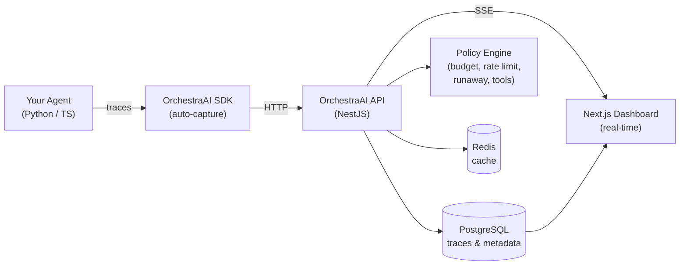

# OrchestraAI

> **Status: Work in Progress** — Core tracing, policy engine, kill switch, and 16 framework integrations are functional. Dashboard UI, evals, and datasets are under active development. Contributions welcome!

**The observability & control plane for autonomous AI agents.**

OrchestraAI gives engineering teams full visibility into what their AI agents are doing — every LLM call, tool invocation, cost, and error — with policy-based controls to prevent runaway behavior in production.

## Why OrchestraAI?

Deploying AI agents is easy. Trusting them in production is hard.

- **Agents run up costs** — a stuck loop can burn through your OpenAI budget in minutes
- **Agents fail silently** — tool calls error, prompts drift, latency spikes go unnoticed
- **Agents are opaque** — "what did the agent do?" shouldn't require reading logs

OrchestraAI is the missing infrastructure layer: **trace what agents do, control what they're allowed to do, and kill them when they go wrong.**

## Supported Frameworks

Works with every major agent framework — drop-in, zero config:

| | Framework | Python | TypeScript | What's Traced |
|---|-----------|:------:|:----------:|---------------|
|  | **OpenAI SDK** | ✅ `openai_agents_tracer` | ✅ auto-extract | LLM calls, streaming, tokens, tool calls |
|  | **Anthropic Claude** | ✅ `anthropic_tracer` | ✅ `anthropicTracer` | Messages, streaming, tool use, TTFT |
|  | **LiteLLM** (100+ models) | ✅ `litellm_tracer` | — | All providers, streaming, tokens |
|  | **Instructor** (structured) | ✅ `instructor_tracer` | — | Structured outputs via OpenAI patch |
|  | **LangChain** | ✅ `langchain_tracer` | ✅ `langchain.ts` | Chains, LLMs, tools, retrievers, streaming |
|  | **LangGraph** | ✅ `langgraph_tracer` | ✅ via LangChain | Graph nodes, state, HITL, streaming |
|  | **DSPy** (Stanford) | ✅ `dspy_tracer` | — | Modules, LM calls, tools, cost |
|  | **Google ADK** | ✅ `google_adk_tracer` | ✅ `google-adk.ts` | Agent lifecycle, LLM, tools, Gemini tokens |
|  | **CrewAI** | ✅ `crewai_tracer` | — | Crews, tasks, agents, tools, LLM calls |
|  | **LlamaIndex** | ✅ `llamaindex_tracer` | — | LLM, retrievers, embeddings, workflows |
|  | **AutoGen** (Microsoft) | ✅ `autogen_tracer` | — | Conversations, per-message LLM, tools |
|  | **Haystack** (deepset) | ✅ `haystack_tracer` | — | Pipelines, generators, retrievers, components |
|  | **smolagents** (HuggingFace) | ✅ `smolagents_tracer` | — | Steps, reasoning, tool calls, max_steps |
|  | **Vercel AI SDK** | — | ✅ `vercel-ai.ts` | generateText, streamText, objects, tools, TTFT |
|  | **OpenTelemetry** | ✅ OTLP endpoint | ✅ OTLP endpoint | Native OTLP span ingestion |

### Integration Depth

Unlike competitors that rely on generic OpenTelemetry instrumentors, OrchestraAI uses **native framework integrations** for deeper tracing:

```
CrewAI trace tree:
  agent_run: research-crew
  ├── step: task:Research Topic (agent: Researcher)
  │   ├── tool: web_search ("AI agents 2024")
  │   └── llm: gpt-4o (62→384 tokens, $0.012)
  ├── step: task:Write Article (agent: Writer)
  │   └── llm: gpt-4o (1.2k→800 tokens, $0.028)
  └── final-output (2 tasks, 2 agents)
```

## Features

### Observability
- **Trace Explorer** — hierarchical trace trees with resizable panels: agent runs → LLM calls → tool calls → retrievers
- **Cost Tracking** — per-model, per-agent cost breakdown with custom pricing support
- **Auto Token Extraction** — tokens and model name auto-detected from OpenAI, Anthropic, Gemini, Cohere, Bedrock responses
- **Streaming Support** — streaming token capture with time-to-first-token (TTFT) tracking
- **Session Tracking** — group multi-turn conversations by session ID
- **Real-time SSE** — live trace streaming to the dashboard with Live/Paused toggle
- **Smart Input Capture** — auto-extracts user-facing input from framework-specific state (question, prompt, messages)

### Control Plane
- **Policy Engine** — budget limits, rate limiting, tool permissions, runaway detection
- **Kill Switch** — instantly halt agents that exceed budget or enter loops ([see demo](#kill-switch))
- **PII Redaction** — automatic redaction of emails, phone numbers, SSNs in trace data
- **Alerts & Webhooks** — policy violations create alerts and fire webhook notifications

### SDKs — Python & TypeScript (1:1 feature parity)

| Feature | Python | TypeScript |
|---------|--------|------------|
| Auto token extraction | `response=response` | `response: response` |
| Kill switch | `AgentKilledException` | `AgentKilledException` |
| Session tracking | `session_id="..."` | `sessionId: "..."` |
| Streaming + TTFT | `add_token()` + `_first_token_time` | `addToken()` + `firstTokenTime` |
| Trace input capture | `trace.set_input("...")` | `trace.setInput("...")` |
| LLM / Tool / Retriever / Agent Action spans | All supported | All supported |

## Architecture



## Quick Start

### Prerequisites
- Node.js >= 20
- Docker & Docker Compose
- Python >= 3.10 (for Python SDK)

### 1. Clone and install

```bash
git clone https://github.com/SiddhantBohra/OrchestraAI.git
cd OrchestraAI
npm install
```

### 2. Configure environment

```bash
cp .env.example .env
```

Edit `.env` and fill in the required values:
```bash
POSTGRES_USER=postgres
POSTGRES_PASSWORD=your-db-password
JWT_SECRET=$(openssl rand -base64 32)
```

### 3. Start infrastructure

```bash
docker compose up -d postgres redis
```

### 4. Run the API and dashboard

```bash
npm run dev:api   # API on http://localhost:3001
npm run dev:web   # Dashboard on http://localhost:3000

# Or both at once
npm run dev:all
```

Swagger docs at [http://localhost:3001/api/docs](http://localhost:3001/api/docs).

### 5. Register and create a project

```bash
# Register
curl -X POST http://localhost:3001/api/auth/register \
  -H 'Content-Type: application/json' \
  -d '{"email":"you@example.com","password":"YourPassword123","name":"Your Name"}'

# Login (save the accessToken)
curl -X POST http://localhost:3001/api/auth/login \
  -H 'Content-Type: application/json' \
  -d '{"email":"you@example.com","password":"YourPassword123"}'

# Create a project (save the rawApiKey — shown only once!)
curl -X POST http://localhost:3001/api/projects \
  -H 'Content-Type: application/json' \
  -H 'Authorization: Bearer YOUR_ACCESS_TOKEN' \
  -d '{"name":"My Project","budgetLimit":50}'
```

### 6. Install an SDK and instrument your agent

#### Python

```bash
pip install -e sdks/python
```

```python
from orchestra_ai import OrchestraAI
from openai import OpenAI

oa = OrchestraAI(api_key="oai_...", base_url="http://localhost:3001")
llm = OpenAI()

with oa.trace("my-agent") as trace:
    response = llm.chat.completions.create(
        model="gpt-4o",
        messages=[{"role": "user", "content": "Hello!"}],
    )
    # Tokens and model auto-extracted from response
    trace.record_llm_call(response=response)
```

#### TypeScript

```bash
# Link the local SDK (not published to npm)
npm link ./sdks/typescript

# Or add as a file dependency in your package.json:
#   "@orchestra-ai/sdk": "file:./path/to/OrchestraAI/sdks/typescript"
```

```typescript
import { OrchestraAI } from '@orchestra-ai/sdk';
import OpenAI from 'openai';

const oa = new OrchestraAI({
  apiKey: 'oai_...',
  baseUrl: 'http://localhost:3001',
});
const openai = new OpenAI();

await oa.trace('my-agent', async (trace) => {
  const response = await openai.chat.completions.create({
    model: 'gpt-4o',
    messages: [{ role: 'user', content: 'Hello!' }],
  });
  // Tokens and model auto-extracted from response
  await trace.llmCall({ response });
});
```

## Kill Switch

The kill switch stops runaway agents mid-execution when budget is exceeded or a policy fires.

```
Agent Loop                     OrchestraAI API
─────────────                  ────────────────
Call #1 → llmCall()  ────────→ Ingest → cost $0.012 → 200 OK
Call #2 → llmCall()  ────────→ Ingest → cost $0.025 → 200 OK
Call #3 → llmCall()  ────────→ Ingest → cost $0.037 → 200 OK
Call #4 → llmCall()  ────────→ Budget exceeded!
                     ←──────── 403 { action: "kill" }
                               AgentKilledException raised
Agent stops immediately.       ✓ No more spending.
```

**Python:**
```python
from orchestra_ai import OrchestraAI, AgentKilledException

try:
    with oa.trace("my-agent") as trace:
        while True:
            response = llm.chat.completions.create(...)
            trace.record_llm_call(response=response)
except AgentKilledException as e:
    print(f"Agent halted: {e.reason}")
```

**TypeScript:**
```typescript
import { OrchestraAI, AgentKilledException } from '@orchestra-ai/sdk';

try {
  await oa.trace('my-agent', async (trace) => {
    while (true) {
      const res = await openai.chat.completions.create({ ... });
      await trace.llmCall({ response: res });
    }
  });
} catch (e) {
  if (e instanceof AgentKilledException) {
    console.log(`Agent halted: ${e.reason}`);
  }
}
```

See full demos: [`examples/kill_switch_demo.py`](examples/kill_switch_demo.py) | [`examples/kill_switch_demo.ts`](examples/kill_switch_demo.ts)

## Examples

Every framework integration has a working, runnable example:

| Example | Python | TypeScript |
|---------|--------|------------|
| **Basic tracing** (LLM + tools + retriever) | [`basic_tracing.py`](examples/basic_tracing.py) | [`basic_tracing.ts`](examples/basic_tracing.ts) |
| **Kill switch** (budget-based agent halt) | [`kill_switch_demo.py`](examples/kill_switch_demo.py) | [`kill_switch_demo.ts`](examples/kill_switch_demo.ts) |
| **OpenAI SDK** auto-traced completions | [`openai_agents.py`](examples/openai_agents.py) | [`openai_agents.ts`](examples/openai_agents.ts) |
| **LangChain** ReAct agent with tools | [`langchain_agent.py`](examples/langchain_agent.py) | [`langchain_agent.ts`](examples/langchain_agent.ts) |
| **LangGraph** auto-instrumented graph | [`langgraph_agent.py`](examples/langgraph_agent.py) | [`langgraph_agent.ts`](examples/langgraph_agent.ts) |
| **Human-in-the-loop** (approval spans) | [`human_in_the_loop.py`](examples/human_in_the_loop.py) | [`human_in_the_loop.ts`](examples/human_in_the_loop.ts) |
| **Google ADK** agent with plugin | [`google_adk_agent.py`](examples/google_adk_agent.py) | — |
| **CrewAI** multi-agent crew | [`crewai_crew.py`](examples/crewai_crew.py) | — |
| **LlamaIndex** RAG pipeline | [`llamaindex_rag.py`](examples/llamaindex_rag.py) | — |

```bash
# Run any Python example
pip install -e sdks/python
export ORCHESTRA_API_KEY=oai_...
python examples/langchain_agent.py

# Run any TypeScript example
export ORCHESTRA_API_KEY=oai_...
npx tsx examples/openai_agents.ts
```

## Project Structure

```
OrchestraAI/
├── apps/
│   ├── api/                # NestJS backend API
│   │   ├── src/modules/    # auth, projects, agents, traces, policies, ingest, dashboard, events, prompts
│   │   └── src/migrations/ # TypeORM migrations (auto-run on startup)
│   └── web/                # Next.js 14 dashboard
├── packages/shared/        # Shared types, enums, pricing constants
├── sdks/
│   ├── python/             # Python SDK — pip install -e sdks/python
│   │   └── orchestra_ai/
│   │       ├── client.py, tracer.py, token_extraction.py
│   │       └── integrations/  # 13 frameworks: langchain, crewai, llamaindex, openai, anthropic, ...
│   └── typescript/         # TypeScript SDK — npm link ./sdks/typescript
│       └── src/
│           ├── client.ts, tracer.ts, token-extraction.ts
│           └── integrations/  # 5 frameworks: langchain, langgraph, vercel-ai, anthropic, google-adk
├── examples/               # 13 working examples (Python + TypeScript)
├── tests/                  # E2E integration tests
├── docker-compose.yml      # Postgres + Redis (ClickHouse optional)
└── turbo.json              # Turborepo build config
```

## API Endpoints

| Group | Method | Path | Description |
|-------|--------|------|-------------|
| Auth | POST | `/api/auth/register` | Register |
| Auth | POST | `/api/auth/login` | Login |
| Projects | CRUD | `/api/projects` | Project management |
| Agents | CRUD | `/api/projects/:id/agents` | Agent registry |
| Traces | GET | `/api/projects/:id/traces` | Query traces |
| Traces | GET | `/api/projects/:id/traces/tree/:traceId` | Trace tree |
| Policies | CRUD | `/api/projects/:id/policies` | Policy management |
| Ingest | POST | `/api/ingest/event` | SDK event ingestion |
| Ingest | POST | `/api/ingest/batch` | Batch ingestion |
| Ingest | POST | `/api/ingest/v1/traces` | OTLP trace ingestion |
| Dashboard | GET | `/api/projects/:id/dashboard/overview` | Analytics |
| Events | GET | `/api/projects/:id/events/stream` | SSE stream |

Full Swagger docs at `/api/docs` when the API is running.

## Roadmap

### Done
- [x] Trace explorer with hierarchical span trees and resizable panels
- [x] Cost tracking with custom pricing
- [x] Auto token extraction (OpenAI, Anthropic, Gemini, Cohere, Bedrock)
- [x] Streaming support with time-to-first-token tracking
- [x] Policy engine (budget, rate limit, runaway, tool permissions)
- [x] Kill switch with `AgentKilledException`
- [x] Human-in-the-loop spans
- [x] 16 framework integrations with deep tracing
- [x] SSE real-time events with Live/Paused toggle
- [x] Smart input capture across all frameworks
- [x] Prompt versioning
- [x] Bcrypt-hashed API keys
- [x] TypeORM migrations
- [x] Noise filtering (internal LangChain runnables hidden)

### In Progress
- [ ] Dashboard UI improvements (trace detail panel, filtering)
- [ ] Agent graph visualization

### Planned
- [ ] Evaluation framework (LLM-as-judge scoring)
- [ ] Datasets & experiments (A/B testing)
- [ ] LLM Playground (test prompts in UI)
- [ ] Annotation queues (human review workflows)
- [ ] Custom dashboards
- [ ] ClickHouse for high-volume trace storage
- [ ] Publish SDKs to PyPI / npm

## Contributing

See [CONTRIBUTING.md](CONTRIBUTING.md) for guidelines.

## License

MIT — see [LICENSE](LICENSE).
