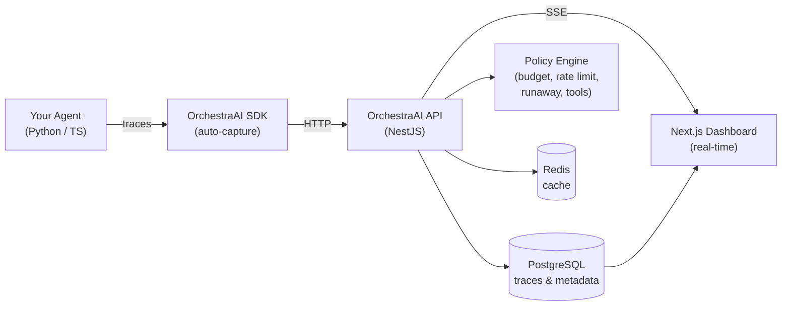

# OrchestraAI

**The observability & control plane for autonomous AI agents.**

OrchestraAI gives engineering teams full visibility into what their AI agents are doing — every LLM call, tool invocation, cost, and error — with policy-based controls to prevent runaway behavior in production.

## Why OrchestraAI?

Deploying AI agents is easy. Trusting them in production is hard.

- **Agents run up costs** — a stuck loop can burn through your OpenAI budget in minutes
- **Agents fail silently** — tool calls error, prompts drift, latency spikes go unnoticed
- **Agents are opaque** — "what did the agent do?" shouldn't require reading logs

OrchestraAI is the missing infrastructure layer: **trace what agents do, control what they're allowed to do, and kill them when they go wrong.**

## Features

### Observability
- **Trace Explorer** — hierarchical trace trees showing agent runs, LLM calls, tool calls, retrievers, and errors
- **Cost Tracking** — per-model, per-agent cost breakdown with custom pricing support
- **Token Analytics** — prompt/completion token counts auto-extracted from OpenAI, Anthropic, Gemini responses
- **Session Tracking** — group multi-turn conversations by session ID
- **Real-time SSE** — live trace streaming to the dashboard

### Control Plane
- **Policy Engine** — budget limits, rate limiting, tool permissions, runaway detection
- **Kill Switch** — instantly halt agents that exceed budget or enter loops ([see how it works](#kill-switch))
- **PII Redaction** — automatic redaction of emails, phone numbers, SSNs in trace data
- **Alerts & Webhooks** — policy violations create alerts and fire webhook notifications

### SDKs (Python & TypeScript — feature parity)

| Feature | Python | TypeScript |
|---------|--------|------------|
| Auto token extraction | `response=response` | `response: response` |
| Kill switch | `AgentKilledException` | `AgentKilledException` |
| Session tracking | `session_id="..."` | `sessionId: "..."` |
| LLM call | `trace.llm_call()` | `trace.llmCallSpan()` |
| Tool call | `trace.tool_call()` | `trace.toolCall()` |
| Retriever span | `trace.retriever_call()` | `trace.retrieverCall()` |
| Agent action span | `trace.agent_action()` | `trace.agentAction()` |
| LangChain/LangGraph | Callback handler | Callback handler |
| CrewAI, LlamaIndex | Framework tracers | — |
| OpenTelemetry | OTLP ingestion | OTLP ingestion |

## Architecture



## Quick Start

### Prerequisites
- Node.js >= 20
- Docker & Docker Compose
- Python >= 3.10 (for Python SDK)

### 1. Clone and install

```bash
git clone https://github.com/SiddhantBohra/OrchestraAI.git
cd OrchestraAI
npm install
```

### 2. Configure environment

```bash
cp .env.example .env
```

Edit `.env` and fill in the required values:
```bash
POSTGRES_USER=postgres
POSTGRES_PASSWORD=your-db-password
JWT_SECRET=$(openssl rand -base64 32)
```

### 3. Start infrastructure

```bash
docker compose up -d postgres redis
```

### 4. Run the API and dashboard

```bash
npm run dev:api   # API on http://localhost:3001
npm run dev:web   # Dashboard on http://localhost:3000

# Or both at once
npm run dev:all
```

Swagger docs at [http://localhost:3001/api/docs](http://localhost:3001/api/docs).

### 5. Register and create a project

```bash
# Register
curl -X POST http://localhost:3001/api/auth/register \
  -H 'Content-Type: application/json' \
  -d '{"email":"you@example.com","password":"YourPassword123","name":"Your Name"}'

# Login (save the accessToken)
curl -X POST http://localhost:3001/api/auth/login \
  -H 'Content-Type: application/json' \
  -d '{"email":"you@example.com","password":"YourPassword123"}'

# Create a project (save the rawApiKey — shown only once!)
curl -X POST http://localhost:3001/api/projects \
  -H 'Content-Type: application/json' \
  -H 'Authorization: Bearer YOUR_ACCESS_TOKEN' \
  -d '{"name":"My Project","budgetLimit":50}'
```

### 6. Install an SDK and instrument your agent

#### Python

```bash
# Install from the local source (not published to PyPI)
pip install -e sdks/python
```

```python
from orchestra_ai import OrchestraAI
from openai import OpenAI

oa = OrchestraAI(api_key="oai_...", base_url="http://localhost:3001")
llm = OpenAI()

with oa.trace("my-agent") as trace:
    response = llm.chat.completions.create(
        model="gpt-4o",
        messages=[{"role": "user", "content": "Hello!"}],
    )
    # Tokens and model auto-extracted from response
    trace.record_llm_call(response=response)
```

#### TypeScript

```bash
# Link the local SDK (not published to npm)
npm link ./sdks/typescript

# Or add it as a file dependency in your project's package.json:
#   "@orchestra-ai/sdk": "file:./path/to/OrchestraAI/sdks/typescript"
# Then run: npm install
```

```typescript
import { OrchestraAI } from '@orchestra-ai/sdk';
import OpenAI from 'openai';

const oa = new OrchestraAI({
  apiKey: 'oai_...',
  baseUrl: 'http://localhost:3001',
});
const openai = new OpenAI();

await oa.trace('my-agent', async (trace) => {
  const response = await openai.chat.completions.create({
    model: 'gpt-4o',
    messages: [{ role: 'user', content: 'Hello!' }],
  });
  // Tokens and model auto-extracted from response
  await trace.llmCall({ response });
});
```

## Kill Switch

The kill switch stops runaway agents mid-execution when budget is exceeded or a policy fires.

```
Agent Loop                     OrchestraAI API
─────────────                  ────────────────
Call #1 → llmCall()  ────────→ Ingest → cost $0.012 → 200 OK
Call #2 → llmCall()  ────────→ Ingest → cost $0.025 → 200 OK
Call #3 → llmCall()  ────────→ Ingest → cost $0.037 → 200 OK
Call #4 → llmCall()  ────────→ Budget exceeded!
                     ←──────── 403 { action: "kill" }
                               AgentKilledException raised
Agent stops immediately.       ✓ No more spending.
```

**Python:**
```python
from orchestra_ai import OrchestraAI, AgentKilledException

try:
    with oa.trace("my-agent") as trace:
        while True:
            response = llm.chat.completions.create(...)
            trace.record_llm_call(response=response)
except AgentKilledException as e:
    print(f"Agent halted: {e.reason}")
```

**TypeScript:**
```typescript
import { OrchestraAI, AgentKilledException } from '@orchestra-ai/sdk';

try {
  await oa.trace('my-agent', async (trace) => {
    while (true) {
      const res = await openai.chat.completions.create({ ... });
      await trace.llmCall({ response: res });
    }
  });
} catch (e) {
  if (e instanceof AgentKilledException) {
    console.log(`Agent halted: ${e.reason}`);
  }
}
```

See full working demos: [`examples/kill_switch_demo.py`](examples/kill_switch_demo.py) | [`examples/kill_switch_demo.ts`](examples/kill_switch_demo.ts)

## Examples

| Example | Python | TypeScript |
|---------|--------|------------|
| Basic tracing (LLM + tools + retriever) | [`examples/basic_tracing.py`](examples/basic_tracing.py) | [`examples/basic_tracing.ts`](examples/basic_tracing.ts) |
| Kill switch demo | [`examples/kill_switch_demo.py`](examples/kill_switch_demo.py) | [`examples/kill_switch_demo.ts`](examples/kill_switch_demo.ts) |
| LangChain integration test | [`tests/langchain_test.py`](tests/langchain_test.py) | — |
| LMStudio local model test | [`tests/lmstudio_test.py`](tests/lmstudio_test.py) | — |

## Project Structure

```
OrchestraAI/
├── apps/
│   ├── api/             # NestJS backend API
│   │   ├── src/
│   │   │   ├── modules/
│   │   │   │   ├── auth/        # JWT authentication
│   │   │   │   ├── projects/    # Project management + API key hashing
│   │   │   │   ├── agents/      # Agent registry
│   │   │   │   ├── traces/      # Trace storage + tree builder
│   │   │   │   ├── policies/    # Policy engine + alerts
│   │   │   │   ├── ingest/      # SDK + OTLP ingestion
│   │   │   │   ├── dashboard/   # Analytics queries
│   │   │   │   ├── events/      # SSE real-time events
│   │   │   │   └── prompts/     # Prompt versioning
│   │   │   └── migrations/      # TypeORM migrations
│   │   └── Dockerfile
│   └── web/             # Next.js dashboard
│       └── Dockerfile
├── packages/
│   └── shared/          # Shared types, enums, pricing constants
├── sdks/
│   ├── python/          # Python SDK (pip install -e sdks/python)
│   └── typescript/      # TypeScript SDK (npm link ./sdks/typescript)
├── examples/            # Working examples for both languages
├── tests/               # E2E integration tests
├── infra/               # ClickHouse init scripts (future)
├── docker-compose.yml
└── turbo.json
```

## API Endpoints

| Group | Method | Path | Description |
|-------|--------|------|-------------|
| Auth | POST | `/api/auth/register` | Register |
| Auth | POST | `/api/auth/login` | Login |
| Projects | CRUD | `/api/projects` | Project management |
| Agents | CRUD | `/api/projects/:id/agents` | Agent registry |
| Traces | GET | `/api/projects/:id/traces` | Query traces |
| Traces | GET | `/api/projects/:id/traces/tree/:traceId` | Trace tree |
| Policies | CRUD | `/api/projects/:id/policies` | Policy management |
| Ingest | POST | `/api/ingest/event` | SDK event ingestion |
| Ingest | POST | `/api/ingest/batch` | Batch ingestion |
| Ingest | POST | `/api/ingest/v1/traces` | OTLP trace ingestion |
| Dashboard | GET | `/api/projects/:id/dashboard/overview` | Analytics |
| Events | GET | `/api/projects/:id/events/stream` | SSE stream |

Full Swagger docs at `/api/docs` when the API is running.

## Running Tests

```bash
# Set required env vars (from your project creation step)
export ORCHESTRA_API_KEY=oai_your_key
export ORCHESTRA_PROJECT_ID=your_project_id
export ORCHESTRA_JWT_TOKEN=your_jwt_token

# Python E2E tests
python tests/langchain_test.py
python tests/lmstudio_test.py

# Examples
python examples/basic_tracing.py
npx tsx examples/basic_tracing.ts
```

## Contributing

See [CONTRIBUTING.md](CONTRIBUTING.md) for guidelines.

## License

MIT — see [LICENSE](LICENSE).
