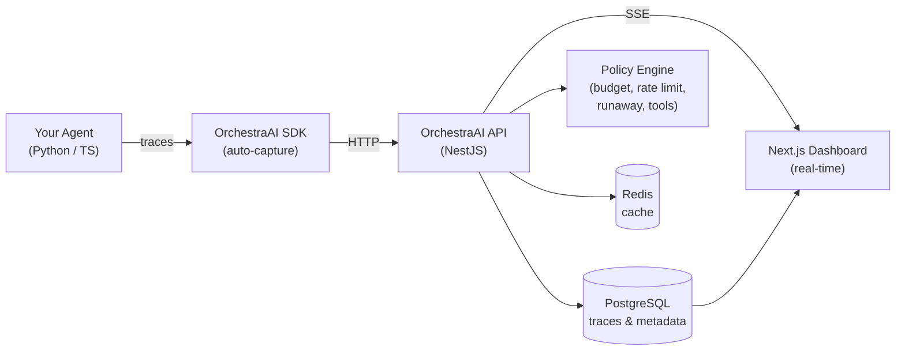

# OrchestraAI

**The observability & control plane for autonomous AI agents.**

OrchestraAI gives engineering teams full visibility into what their AI agents are doing — every LLM call, tool invocation, cost, and error — with policy-based controls to prevent runaway behavior in production.

## Why OrchestraAI?

Deploying AI agents is easy. Trusting them in production is hard.

- **Agents run up costs** — a stuck loop can burn through your OpenAI budget in minutes
- **Agents fail silently** — tool calls error, prompts drift, latency spikes go unnoticed
- **Agents are opaque** — "what did the agent do?" shouldn't require reading logs

OrchestraAI is the missing infrastructure layer: **trace what agents do, control what they're allowed to do, and kill them when they go wrong.**

## Features

### Observability
- **Trace Explorer** — hierarchical trace trees showing agent runs, LLM calls, tool calls, and errors
- **Cost Tracking** — per-model, per-agent cost breakdown with custom pricing support
- **Token Analytics** — prompt/completion token counts auto-extracted from LLM responses
- **Session Tracking** — group multi-turn conversations by session ID
- **Real-time SSE** — live trace streaming to the dashboard

### Control Plane
- **Policy Engine** — budget limits, rate limiting, tool permissions, runaway detection
- **Kill Switch** — instantly halt agents that exceed budget or enter loops
- **PII Redaction** — automatic redaction of emails, phone numbers, SSNs in trace data
- **Alerts & Webhooks** — policy violations create alerts and fire webhook notifications

### SDK & Integrations
- **Python SDK** — context-manager API with auto token extraction from OpenAI/Anthropic responses
- **TypeScript SDK** — callback and manual tracing patterns
- **LangChain/LangGraph** — callback handler auto-captures all LLM + tool spans
- **OpenTelemetry** — native OTLP ingestion for teams already using OTEL
- **LlamaIndex, CrewAI** — framework-specific tracers

## Architecture



## Quick Start

### Prerequisites
- Node.js >= 20
- Docker & Docker Compose
- Python >= 3.10 (for Python SDK)

### 1. Clone and install

```bash
git clone https://github.com/your-org/orchestra-ai.git
cd orchestra-ai
npm install
```

### 2. Start infrastructure

```bash
cp .env.example .env
# Edit .env — set a strong JWT_SECRET

docker compose up -d postgres redis
```

### 3. Run the API and dashboard

```bash
# Development mode (hot reload)
npm run dev:api   # API on http://localhost:3001
npm run dev:web   # Dashboard on http://localhost:3000

# Or both at once
npm run dev:all
```

### 4. Open Swagger docs

Visit [http://localhost:3001/api/docs](http://localhost:3001/api/docs) to explore the API.

### 5. Register and create a project

```bash
# Register
curl -X POST http://localhost:3001/api/auth/register \
  -H 'Content-Type: application/json' \
  -d '{"email":"you@example.com","password":"YourPassword123","name":"Your Name"}'

# Login (save the accessToken)
curl -X POST http://localhost:3001/api/auth/login \
  -H 'Content-Type: application/json' \
  -d '{"email":"you@example.com","password":"YourPassword123"}'

# Create a project (save the rawApiKey — shown only once)
curl -X POST http://localhost:3001/api/projects \
  -H 'Content-Type: application/json' \
  -H 'Authorization: Bearer YOUR_ACCESS_TOKEN' \
  -d '{"name":"My Project","budgetLimit":50}'
```

### 6. Instrument your agent

**Python:**
```bash
pip install -e sdks/python
```

```python
from orchestra_ai import OrchestraAI
from openai import OpenAI

oa = OrchestraAI(api_key="oai_...", base_url="http://localhost:3001")
llm = OpenAI()

with oa.trace("my-agent") as trace:
    response = llm.chat.completions.create(
        model="gpt-4o",
        messages=[{"role": "user", "content": "Hello!"}],
    )
    # Tokens and model auto-extracted from response
    trace.record_llm_call(response=response)
```

**TypeScript:**
```typescript
import { OrchestraAI } from '@orchestra-ai/sdk';

const oa = new OrchestraAI({
  apiKey: 'oai_...',
  baseUrl: 'http://localhost:3001',
});

await oa.trace('my-agent', async (trace) => {
  await trace.llmCall({
    model: 'gpt-4o',
    inputTokens: 100,
    outputTokens: 50,
  });
});
```

## Project Structure

```
orchestra-ai/
├── apps/
│   ├── api/             # NestJS backend API
│   │   ├── src/
│   │   │   ├── modules/
│   │   │   │   ├── auth/        # JWT authentication
│   │   │   │   ├── projects/    # Project management + API key hashing
│   │   │   │   ├── agents/      # Agent registry
│   │   │   │   ├── traces/      # Trace storage + tree builder
│   │   │   │   ├── policies/    # Policy engine + alerts
│   │   │   │   ├── ingest/      # SDK + OTLP ingestion
│   │   │   │   ├── dashboard/   # Analytics queries
│   │   │   │   ├── events/      # SSE real-time events
│   │   │   │   └── prompts/     # Prompt versioning
│   │   │   └── migrations/      # TypeORM migrations
│   │   └── Dockerfile
│   └── web/             # Next.js dashboard
│       └── Dockerfile
├── packages/
│   └── shared/          # Shared types, enums, utilities
├── sdks/
│   ├── python/          # Python SDK
│   │   └── orchestra_ai/
│   │       ├── client.py
│   │       ├── tracer.py
│   │       ├── token_extraction.py
│   │       └── integrations/    # LangChain, LangGraph, CrewAI, LlamaIndex
│   └── typescript/      # TypeScript SDK
├── tests/               # E2E integration tests
├── infra/               # ClickHouse init scripts
├── docker-compose.yml
└── turbo.json
```

## API Endpoints

| Group | Method | Path | Description |
|-------|--------|------|-------------|
| Auth | POST | `/api/auth/register` | Register |
| Auth | POST | `/api/auth/login` | Login |
| Projects | CRUD | `/api/projects` | Project management |
| Agents | CRUD | `/api/projects/:id/agents` | Agent registry |
| Traces | GET | `/api/projects/:id/traces` | Query traces |
| Traces | GET | `/api/projects/:id/traces/tree/:traceId` | Trace tree |
| Policies | CRUD | `/api/projects/:id/policies` | Policy management |
| Ingest | POST | `/api/ingest/event` | SDK event ingestion |
| Ingest | POST | `/api/ingest/batch` | Batch ingestion |
| Ingest | POST | `/api/ingest/v1/traces` | OTLP trace ingestion |
| Dashboard | GET | `/api/projects/:id/dashboard/overview` | Analytics |
| Events | GET | `/api/projects/:id/events/stream` | SSE stream |

Full Swagger docs at `/api/docs` when the API is running.

## Running Tests

```bash
# E2E tests (requires running API + Postgres)
export ORCHESTRA_API_KEY=oai_your_key
export ORCHESTRA_PROJECT_ID=your_project_id
export ORCHESTRA_JWT_TOKEN=your_jwt_token

python tests/langchain_test.py
python tests/lmstudio_test.py
```

## Contributing

See [CONTRIBUTING.md](CONTRIBUTING.md) for guidelines.

## License

MIT — see [LICENSE](LICENSE).
